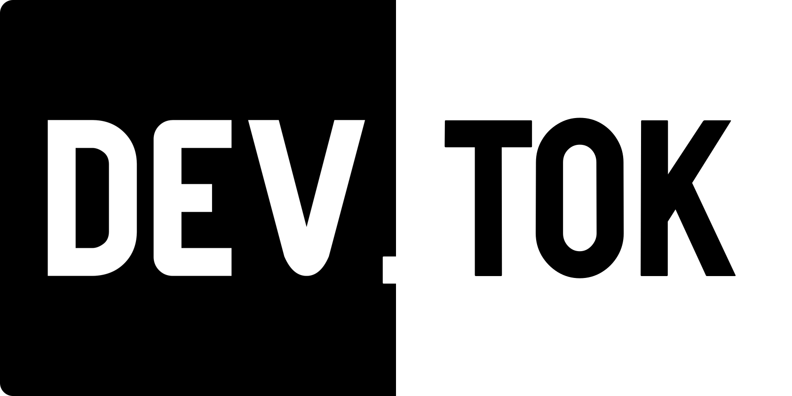

# Dev.tok




[](https://github.com/Nick-Gabe/dev.tok/graphs/contributors)
[](https://github.com/Nick-Gabe/dev.tok/issues)

Dev.tok is an open-source web application that leverages the [dev.to API](https://developers.forem.com/api) to display content in a feed-like manner, similar to TikTok and Instagram Reels. The goal is to enhance user engagement by providing a seamless and interactive browsing experience.

Visit the live website at [devtok.xyz](https://devtok.xyz/).

## Features

- **Feed-like Interface**: Browse articles in a visually engaging, swipeable format.
- **Comments**: View and interact with comments on articles.
- **Localization**: Supports multiple languages using `i18next`.
- **Responsive Design**: Optimized for both desktop and mobile devices.

## Contributing

We accept contributions of all kinds, including bug fixes, feature requests, and documentation improvements. If you're interested in contributing, here's a quick guide to get you started:

### Prerequisites

- [Node.js](https://nodejs.org/)
- [pnpm](https://pnpm.io/)

### Installation

1. Clone the repository:
    ```sh
    git clone https://github.com/Nick-Gabe/dev.tok.git
    cd dev.tok
    ```

2. Install dependencies:
    ```sh
    pnpm install
    ```

3. Start the development server:
    ```sh
    pnpm dev
    ```

4. Open your browser and navigate to `http://localhost:3000`.
